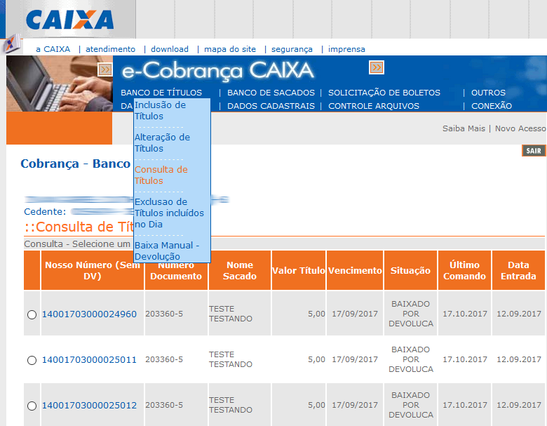

**e-Cobranca**

Cobrança registrada da Caixa Econômica Federal

Webservice de acesso às operações básicas de consulta, inclusão e alteração
de cobranças registradas segundo o [manual fornecido pela CEF](docs/Manual_Leiaute_Webservice.pdf).
Existem algumas divergências devido às frequentes modificações no serviço pela
CEF, mas encontra-se funcional e estável na data de publicação deste código.

---

## Instalação
### Composer

Se você já conhece o **Composer** (o que é extremamente recomendado), simplesmente adicione a dependência ao seu projeto.

```
composer require toolstore/e-cobranca @dev
```

---

## Inclusão de títulos

```
use Caixa\Boleto;

$boleto = new Boleto();

$boleto->setCodigoBeneficiario('012345');
$boleto->setUnidade('0000');
$boleto->setIdProcesso('012345');
$boleto->setCnpj('000.000.000/0000-00');
$boleto->setNossoNumero('14000000000000000');
$boleto->setNumeroDocumento('TEST0001');
$boleto->setDataVencimento('2018-09-30');
$boleto->setValor('1.0');
$boleto->setTipoEspecie('02');
$boleto->setFlagAceite('N');
$boleto->setDataEmissao('2018-09-11');
$boleto->setValorAbatimento('0');
$boleto->setNumeroDias('30');
$boleto->setCpf('000.000.000-00');
$boleto->setNome('Jean Barbosa dos Santos');
$boleto->setLogradouro('E. Paranhos, Nº 00');
$boleto->setCidade('Brasilia');
$boleto->setUf('DF');
$boleto->setCep('00.000-000');

$response = $boleto->incluirBoleto();

print_r($response);

```
---

## Alteração de títulos
Resaltando que alguns campos não é possível ser alterados...

```
use Caixa\Boleto;

$boleto = new Boleto();

$boleto->setCodigoBeneficiario('012345');
$boleto->setUnidade('0000');
$boleto->setIdProcesso('012345');
$boleto->setCnpj('000.000.000/0000-00');
$boleto->setNossoNumero('14000000000000000');
$boleto->setNumeroDocumento('TEST0001');
$boleto->setDataVencimento('2019-09-30');  //alterando data de vencimento
$boleto->setValor('1.0');
$boleto->setTipoEspecie('02');
$boleto->setFlagAceite('N');
$boleto->setValorAbatimento('0');
$boleto->setNumeroDias('30');
$boleto->setNome('Jean Barbosa dos Santos');
$boleto->setLogradouro('E. Paranhos, Nº 00');
$boleto->setCidade('Brasilia');
$boleto->setUf('DF');
$boleto->setCep('00.000-000');

$response = $boleto->alterarBoleto();

print_r($response);

```
---

## Baixa de títulos

```
use Caixa\Boleto;

$boleto = new Boleto();

$boleto->setCodigoBeneficiario('012345');
$boleto->setNossoNumero('14000000000000000');

$response = $boleto->baixaBoleto();

print_r($response);

```
---

## Consulta de títulos

```
use Caixa\Boleto;

$boleto = new Boleto();

$boleto->setCodigoBeneficiario('012345');
$boleto->setCnpj('000.000.000/0000-00');
$boleto->setNossoNumero('14000000000000000');

$response = $boleto->consultarBoleto();

print_r($response);

```

Você pode conferir se as operações do WebService estão corretas usando
o sistema [e-Cobrança](doc/ecobranca-consulta-titulos.png) da Caixa.
Acesse ""Banco de títulos > Consulta de títulos", deixe o formulário em
branco e clique em "Consultar" para exibir todos os títulos.



---

## Depuração

Todas as tentativas de transação com o WebService e seus conteúdos podem
ser verificados ao setar a variável `debug` para `true`.

//SGCBS02P - Produção | SGCBS01D - Desenvolvimento

```
use Caixa\Boleto;

$boleto = new Boleto();
$boleto->setDebug(true);

//set fields

$response = $boleto->consultarBoleto();

print_r($response);

```